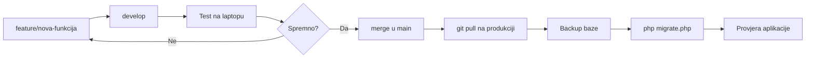

# PlanTim — Deployment i Git workflow

Ovaj dokument opisuje lokalni razvoj, Git grananje, siguran deploy na produkciju i backup baze.

---

## Važna pravila

| Pravilo | Objašnjenje |
|---------|-------------|
| **Produkcijska baza se nikad ne prepisuje lokalnom** | Zabranjeno je `mysqldump` s laptopa → restore na server. Samo SQL migracije (`migrate.php`) mijenjaju strukturu na produkciji. |
| **Sve promjene strukture kroz SQL migracije** | Nove tabele, kolone, indeksi → novi `.sql` fajl u `database/migrations/sql/`. |
| **Uploads folder se ne šalje na GitHub** | `storage/app/public/` je u `.gitignore`. Na serveru se **nikad ne briše** pri deployu. |
| **`.env` sa lozinkama ne ide na GitHub** | Samo `.env.example` (bez tajni) je u repou. |

---

## Struktura grananja (GitHub)

```
main      → produkcija (stabilna verzija)
develop   → razvoj (integracija funkcionalnosti)
feature/* → pojedinačne nove funkcionalnosti
```

### Preporučeni workflow



### Korak po korak

#### 1. Lokalni razvoj na `develop` grani

```bash
git checkout develop
git pull origin develop

# Nova funkcionalnost
git checkout -b feature/naziv-funkcije
# ... razvoj ...
git add .
git commit -m "feat: opis promjene"
git push -u origin feature/naziv-funkcije
```

Kreiraj Pull Request: `feature/naziv-funkcije` → `develop`

#### 2. Testiranje na laptopu

```bash
git checkout develop
git pull origin develop

# Backend
composer install
cp .env.example .env   # samo prvi put
php artisan key:generate

# Frontend
cd frontend
npm install
npm run build   # ili npm run dev za razvoj

# SQL migracije (struktura baze)
php migrate.php

# Laravel migracije (ako još koristite legacy PHP migracije)
php artisan migrate

# Pokretanje
php artisan serve
```

Provjeri ključne module, login, upload fajlova i nove funkcionalnosti.

#### 3. Merge u `main` kada je verzija spremna

```bash
git checkout main
git pull origin main
git merge develop
git push origin main
```

Ili Pull Request: `develop` → `main` (preporučeno za pregled).

#### 4. Deploy na produkciji — `git pull`

Na serveru (SSH):

```bash
cd /var/www/plantim   # prilagodite putanju

# BACKUP PRVO — obavezno (vidi sekciju Backup)
./scripts/backup-before-deploy.sh   # Linux
# ili ručno mysqldump (vidi dolje)

git fetch origin
git checkout main
git pull origin main

composer install --no-dev --optimize-autoloader
cd frontend && npm ci && npm run build && cd ..

php artisan config:cache
php artisan route:cache
php artisan view:cache
```

**NE pokretati:**
- `php artisan migrate:fresh`
- `RESTORE_DATABASE.bat` s lokalnog dumpa
- brisanje `storage/app/public/`

#### 5. Pokretanje migracija

```bash
php migrate.php
```

Provjera bez izvršavanja:

```bash
php migrate.php --dry-run
```

#### 6. Provjera aplikacije

- [ ] Login radi
- [ ] API odgovara (`/api/health` ili glavna stranica)
- [ ] Uploadani fajlovi su još dostupni
- [ ] Nova funkcionalnost radi
- [ ] Nema grešaka u `storage/logs/laravel.log`

---

## Inicijalno postavljanje Git repozitorija

Ako repozitorij još nije na GitHubu:

```bash
cd C:\xampp\htdocs\PlanTim

git init
git add .
git commit -m "chore: inicijalni commit PlanTim projekta"

git branch -M main
git checkout -b develop

# Na GitHubu kreiraj prazan repo (bez README), zatim:
git remote add origin https://github.com/VAS_ORG/PlanTim.git
git push -u origin main
git push -u origin develop
```

---

## Konfiguracija baze (`.env`)

### Lokalno (XAMPP)

```env
APP_ENV=local
APP_DEBUG=true
DB_HOST=127.0.0.1
DB_PORT=3306
DB_DATABASE=plantim
DB_USERNAME=root
DB_PASSWORD=
```

### Produkcija

```env
APP_ENV=production
APP_DEBUG=false
DB_HOST=127.0.0.1
DB_DATABASE=plantim_prod
DB_USERNAME=plantim_user
DB_PASSWORD=jak-lozinka
```

Kopiranje predloška:

```bash
cp .env.example .env
# Uredite .env — lozinke i URL-ove
```

---

## SQL migracije

### Folder

```
database/migrations/sql/
├── 2024_01_01_000001_create_password_reset_tokens_table.sql
├── 2026_01_25_000001_create_role_module_permissions_table.sql
└── YYYY_MM_DD_HHMMSS_opis_promjene.sql   ← nove migracije
```

### Imenovanje

Format: `YYYY_MM_DD_HHMMSS_kratki_opis.sql`

Primjer nove migracije:

```sql
-- Dodaj kolonu status u planika_finance_credits
ALTER TABLE `planika_finance_credits`
  ADD COLUMN IF NOT EXISTS `status` varchar(50) NULL AFTER `amount`;
```

> **Napomena:** Koristite idempotentne naredbe gdje je moguće (`IF NOT EXISTS`, provjera prije `ALTER`).

### Tabela `migrations`

`migrate.php` koristi istu `migrations` tabelu kao Laravel. SQL fajlovi se bilježe punim imenom fajla (npr. `2026_07_15_120000_add_column.sql`). Pokreću se **samo novi** fajlovi, sortirani abecedno po imenu.

### Pokretanje

```bash
# Windows (XAMPP)
RUN_SQL_MIGRATIONS.bat

# Ili direktno
php migrate.php
php migrate.php --dry-run
```

### Laravel PHP migracije (legacy)

Postojeće migracije u `database/migrations/*.php` i dalje se pokreću preko:

```bash
php artisan migrate
```

Za **nove promjene strukture na produkciji** koristite isključivo SQL migracije u `database/migrations/sql/`.

---

## Backup baze prije deploy-a

### Zašto je obavezno

Prije svakog `git pull` + `migrate.php` na produkciji napravite backup. Ako migracija ne uspije, možete vratiti bazu bez gubitka podataka.

### Windows (lokalno) — `BACKUP_DATABASE.bat`

```bat
BACKUP_DATABASE.bat
```

Kreira: `backups/backup_YYYYMMDD_HHMMSS.sql`

### Linux / produkcija — ručno

```bash
mkdir -p backups
TIMESTAMP=$(date +%Y%m%d_%H%M%S)
mysqldump -u DB_USER -p DB_NAME > backups/pre_deploy_${TIMESTAMP}.sql
gzip backups/pre_deploy_${TIMESTAMP}.sql   # opcionalno kompresija
```

### Linux — skripta u repou

```bash
chmod +x scripts/backup-before-deploy.sh
./scripts/backup-before-deploy.sh
```

Skripta čita `DB_*` vrijednosti iz `.env`.

### Checklist prije deploy-a

1. [ ] Backup produkcijske baze kreiran i provjeren (fajl nije prazan)
2. [ ] Backup pohranjen izvan servera (S3, drugi disk, laptop)
3. [ ] `php migrate.php --dry-run` na stagingu ili lokalno s kopijom prod sheme
4. [ ] `git pull` samo na `main` grani
5. [ ] `php migrate.php` na produkciji
6. [ ] Smoke test aplikacije

### Restore (samo na istom okruženju!)

**UPOZORENJE:** Nikad ne restore-ujte lokalni dump na produkciju.

Restore je dozvoljen samo za oporavak **produkcijskog** backupa na **produkciji**:

```bash
mysql -u DB_USER -p DB_NAME < backups/pre_deploy_YYYYMMDD_HHMMSS.sql
```

---

## Šta ne commitovati na GitHub

- `.env` (lozinke, API ključevi)
- `vendor/`, `node_modules/`
- `storage/app/public/*` (uploadi korisnika)
- `backups/*.sql` (dumpovi baze)
- `frontend/dist/`

Sve je definisano u `.gitignore`.

---

## Deploy checklist (kratka verzija)

| Korak | Komanda / akcija |
|-------|------------------|
| 1. Backup | `mysqldump` ili `BACKUP_DATABASE.bat` |
| 2. Pull | `git pull origin main` |
| 3. Dependencies | `composer install --no-dev` |
| 4. Frontend build | `cd frontend && npm ci && npm run build` |
| 5. Migracije | `php migrate.php` |
| 6. Cache | `php artisan config:cache` |
| 7. Test | Login, API, uploadi, novi modul |

---

## Windows Server + XAMPP (produkcija)

Isto okruženje kao na laptopu: `C:\xampp\`, projekat u `C:\xampp\htdocs\PlanTim`.

### Jednokratno podešavanje servera

#### 1. Instaliraj alate

- **XAMPP** (Apache + MySQL + PHP 8.2+) — ista verzija kao laptop po mogućnosti
- **Git for Windows** — [https://git-scm.com/download/win](https://git-scm.com/download/win)
- **Composer** — [https://getcomposer.org/download/](https://getcomposer.org/download/)
- **Node.js LTS** — za `npm run build`

#### 2. Kloniraj projekat

Otvori **CMD** ili **PowerShell** kao administrator:

```powershell
cd C:\xampp\htdocs
git clone https://github.com/Cico225/PlanTim.git PlanTim
cd PlanTim
git checkout main
```

**Autentifikacija (HTTPS):** pri prvom push/pull GitHub traži:
- Username: `Cico225`
- Password: **Personal Access Token** (ne GitHub lozinka)

Token: GitHub → Settings → Developer settings → Personal access tokens → **repo** scope.

#### 3. `.env` na serveru (ručno, nikad s GitHuba)

```powershell
copy .env.example .env
notepad .env
```

Produkcijske vrijednosti:

```env
APP_ENV=production
APP_DEBUG=false
APP_URL=http://tvoj-server-adresa

DB_DATABASE=plantim
DB_USERNAME=root
DB_PASSWORD=
```

Generiši ključ:

```powershell
C:\xampp\php\php.exe artisan key:generate
```

#### 4. Prvi setup

```powershell
cd C:\xampp\htdocs\PlanTim
composer install --no-dev --optimize-autoloader
cd frontend
npm ci
npm run build
cd ..
C:\xampp\php\php.exe migrate.php
C:\xampp\php\php.exe artisan migrate --force
C:\xampp\php\php.exe artisan storage:link
```

#### 5. Apache virtual host

Document root mora biti **`C:\xampp\htdocs\PlanTim\public`** (ne root projekta).

U `C:\xampp\apache\conf\extra\httpd-vhosts.conf` primjer:

```apache
<VirtualHost *:80>
    ServerName plantim.tvoj-domen.local
    DocumentRoot "C:/xampp/htdocs/PlanTim/public"
    <Directory "C:/xampp/htdocs/PlanTim/public">
        AllowOverride All
        Require all granted
    </Directory>
</VirtualHost>
```

Restart Apache iz XAMPP Control Panela.

#### 6. Uredi `BACKUP_DATABASE.bat` na serveru

Provjeri da `DB_NAME` i `DB_USER` odgovaraju produkcijskoj bazi.

#### 7. Uploadi

Folder `storage\app\public\` **ne briši** pri deployu — tu su korisnički fajlovi. Nije na GitHubu, ostaje samo na serveru.

---

### Svaki deploy (nova verzija)

**Na laptopu:**
1. Test na `develop`
2. Merge `develop` → `main` na GitHubu

**Na serveru — dupli klik ili CMD:**

```bat
C:\xampp\htdocs\PlanTim\PULL_FROM_GITHUB.bat
```

Ili (isto radi):

```bat
C:\xampp\htdocs\PlanTim\DEPLOY.bat
```

**Na laptopu — po testiranju:**

```bat
C:\xampp\htdocs\PlanTim\PUSH_TO_GITHUB.bat
```

Skripta automatski:
1. Backup baze (`BACKUP_DATABASE.bat`)
2. `git pull origin main`
3. `composer install --no-dev`
4. `npm ci` + `npm run build`
5. `php migrate.php` + `php artisan migrate --force`
6. Laravel cache

**Ručno (korak po korak):**

```powershell
cd C:\xampp\htdocs\PlanTim
.\BACKUP_DATABASE.bat
git fetch origin
git checkout main
git pull origin main
composer install --no-dev --optimize-autoloader
cd frontend; npm ci; npm run build; cd ..
C:\xampp\php\php.exe migrate.php
C:\xampp\php\php.exe artisan migrate --force
C:\xampp\php\php.exe artisan config:cache
C:\xampp\php\php.exe artisan route:cache
C:\xampp\php\php.exe artisan view:cache
```

### Zabranjeno na produkcijskom serveru

- `git pull origin develop` — samo **`main`**
- `RESTORE_DATABASE.bat` s laptop dumpom
- `php artisan migrate:fresh`
- Brisanje `storage\app\public\`

---

## Kontakt / napomene

- Za hitne rollback scenarije: restore produkcijskog backupa, zatim `git checkout` na prethodni commit na `main`.
- Pitanja o migracijama: sve strukturalne promjene dokumentujte u commit poruci i imenu SQL fajla.
